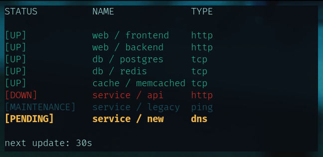

# Kuma Monitor

A Python script to check Uptime Kuma monitor status via command line with automatic updates.



## Features

- **🔄 Auto-update** every 30 seconds (configurable)
- **🎨 Colored output** for better visualization
- **📊 Table format** similar to docker stats
- **⚙️ Configurable** via environment variables
- **📱 Clean interface** with optional header and countdown

## Installation

No installation required! The script is completely standalone and only uses Python standard library modules plus `requests` (which is usually pre-installed).

```bash
# If requests is not installed (rare)
pip install requests
```

## Configuration

### Environment Variables

The script can be configured using environment variables:

| Variable | Default | Description |
|----------|---------|-------------|
| `KUMA_ENDPOINT` | `https://your-kuma-server.com/metrics` | Uptime Kuma metrics endpoint |
| `KUMA_API_KEY` | `your-api-key-here` | API key for authentication |
| `KUMA_UPDATE_INTERVAL` | `30` | Update interval in seconds |
| `KUMA_SHOW_HEADER` | `true` | Show table header (true/false) |
| `KUMA_SHOW_COUNTDOWN` | `true` | Show countdown timer (true/false) |

### Setup Options

#### Option 1: Using .env file
```bash
# Copy the example file
cp .env.example .env

# Edit the configuration
vim .env
```

#### Option 2: Using export commands
```bash
export KUMA_ENDPOINT="https://your-endpoint.com/metrics"
export KUMA_API_KEY="your-api-key"
export KUMA_UPDATE_INTERVAL="60"
export KUMA_SHOW_HEADER="false"
export KUMA_SHOW_COUNTDOWN="false"
```

## Usage

```bash
./kuma-monitor.py
```

### Standalone Execution

The script is completely standalone:
- Python 3.6+ (standard library only)
- `requests` library (usually pre-installed)
- No external dependencies
- No installation required

## Examples

### Minimal output (no header, no countdown)
```bash
export KUMA_SHOW_HEADER="false"
export KUMA_SHOW_COUNTDOWN="false"
./kuma-monitor.py
```

### Custom update interval
```bash
export KUMA_UPDATE_INTERVAL="60"
./kuma-monitor.py
```

### Custom endpoint
```bash
export KUMA_ENDPOINT="https://your-uptime-kuma.com/metrics"
export KUMA_API_KEY="your-api-key"
./kuma-monitor.py
```

## Output Example

```
STATUS          NAME              TYPE        
[UP]            web / frontend    http        
[UP]            web / backend     http        
[UP]            db / postgres     tcp         
[UP]            db / redis        tcp         
[UP]            cache / memcached tcp         
[DOWN]          service / api     http        
[MAINTENANCE]   service / legacy  ping        
[PENDING]       service / new     dns         
next update: 30s
```

## Status Colors

- 🟢 **Green**: UP
- 🔴 **Red**: DOWN  
- 🟡 **Yellow**: PENDING
- 🔵 **Blue**: MAINTENANCE

## Exit

Press `Ctrl+C` to exit gracefully.


License
-------

© 2025 [Acauã Montiel](http://acauamontiel.com.br)

[MIT License](http://acaua.mit-license.org/)